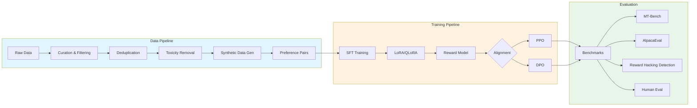

# rlhf-finetune-pipeline

**End-to-end post-training pipeline: Data Curation → SFT → LoRA/QLoRA → Reward Modeling → PPO/DPO with scaling analysis and reward hacking detection**

[](https://github.com/yourusername/rlhf-finetune-pipeline/actions/workflows/ci.yml)
[](https://opensource.org/licenses/MIT)
[](https://www.python.org/downloads/)

## Overview

`rlhf-finetune-pipeline` is a production-grade, end-to-end post-training pipeline for Large Language Models (LLMs) covering the full stack from data curation to alignment. Unlike frameworks that focus solely on RLHF, this pipeline provides a complete workflow from raw data processing through final evaluation.

The pipeline supports multiple alignment strategies (PPO and DPO), enables scaling experiments across model sizes (70M to 1B+ parameters), and includes comprehensive tooling for detecting and mitigating reward hacking.

## Architecture



## Pipeline Stages

### 1. Data Curation (`data/curation.py`)
Quality filtering and preprocessing of raw training data. Includes deduplication using MinHash LSH, toxicity filtering using classifier-based detection, and quality scoring based on perplexity and coherence metrics. This stage ensures only high-quality, diverse data enters the training pipeline.

### 2. Synthetic Data Generation (`data/synthetic.py`)
Generates additional training data using teacher models. Implements Self-Instruct for instruction generation from seed tasks and Evol-Instruct for iterative complexity evolution. Enables bootstrapping diverse instruction-following datasets without extensive human annotation.

### 3. Preference Pair Generation (`data/preference.py`)
Creates chosen/rejected pairs for reward model training and DPO. Supports multiple strategies: model-generated comparisons with quality ranking, human preference data integration, and constitutional AI-style self-critique. Critical for learning human preferences.

### 4. Supervised Fine-Tuning (`finetune/sft_trainer.py`)
Fine-tunes base models on instruction-following data using LoRA/QLoRA for parameter-efficient training. Supports multiple chat templates (ChatML, Alpaca, Vicuna) and handles multi-turn conversations. This stage transforms base LLMs into instruction-following models.

### 5. Reward Modeling (`reward/reward_model.py`)
Trains a scalar reward model to predict human preferences. Uses Bradley-Terry preference modeling with margin-based ranking loss. The reward model provides the training signal for PPO alignment and enables reward hacking detection.

### 6. PPO Alignment (`alignment/ppo_trainer.py`)
Proximal Policy Optimization with KL penalty to prevent distribution collapse. Implements Generalized Advantage Estimation (GAE), value function clipping, and adaptive KL targeting. The standard RLHF approach for aligning LLMs with human preferences.

### 7. DPO Alignment (`alignment/dpo_trainer.py`)
Direct Preference Optimization as a simpler alternative to PPO. Directly optimizes the policy on preference data without explicit reward modeling. Supports multiple loss variants (sigmoid, hinge, IPO) and reference model management.

### 8. Evaluation (`evaluation/`)
Comprehensive evaluation suite including MT-Bench and AlpacaEval integration, reward hacking detection (length exploitation, sycophancy, repetition), scaling analysis across model sizes, and human preference evaluation framework.

## Key Features

1. **Full Pipeline Coverage** - Not just RLHF, but the complete workflow from data curation through evaluation. Every stage is modular and configurable.

2. **LoRA/QLoRA First-Class Support** - Designed for consumer GPU training. Fine-tune 7B models on a single 24GB GPU using 4-bit quantization with QLoRA.

3. **Synthetic Data Generation** - Built-in Self-Instruct and Evol-Instruct implementations for bootstrapping training data from minimal seed examples.

4. **PPO vs DPO Comparison** - Head-to-head comparison framework on the same base model and data. Understand the trade-offs between approaches.

5. **Reward Hacking Detection** - Automated detection of:
   - Length exploitation (models gaming reward by generating longer outputs)
   - Sycophancy (excessive agreement/flattery)
   - Repetition patterns (reward gaming through repeated phrases)

6. **Scaling Analysis** - Track alignment quality across model sizes (Pythia 70M → 410M → 1B) to understand how alignment techniques scale.

## Supported Models

| Model Family | Sizes | Notes |
|-------------|-------|-------|
| Pythia | 70M, 410M, 1B | Ideal for scaling experiments |
| Llama-2 | 7B | Production fine-tuning with QLoRA |
| Mistral | 7B | State-of-the-art 7B base model |

## Quick Start

### Installation

```bash
# Clone the repository
git clone https://github.com/yourusername/rlhf-finetune-pipeline.git
cd rlhf-finetune-pipeline

# Install with pip
pip install -e ".[dev]"

# Or with optional notebook dependencies
pip install -e ".[dev,notebooks]"
```

### Run the Full Pipeline

```bash
# 1. Run SFT training
python scripts/run_sft.py --config configs/sft_config.yaml

# 2. Train reward model
python scripts/run_reward.py --config configs/reward_config.yaml

# 3. Run PPO alignment
python scripts/run_ppo.py --config configs/ppo_config.yaml

# 4. Or run DPO alignment
python scripts/run_dpo.py --config configs/dpo_config.yaml

# 5. Compare PPO vs DPO
python scripts/run_comparison.py --ppo-checkpoint ./outputs/ppo --dpo-checkpoint ./outputs/dpo
```

### Configuration

All pipeline stages are configured via YAML files in `configs/`. See individual config files for detailed parameter documentation.

## Results

### PPO vs DPO Comparison (Llama-2-7B)

| Metric | Base Model | SFT | PPO | DPO |
|--------|-----------|-----|-----|-----|
| MT-Bench | - | - | - | - |
| AlpacaEval Win Rate | - | - | - | - |
| Avg Response Length | - | - | - | - |
| Reward Score | - | - | - | - |
| KL Divergence | - | - | - | - |

*Results to be populated after training runs.*

### Scaling Analysis (Pythia Family)

| Model Size | SFT Loss | Reward Accuracy | PPO Reward | DPO Win Rate |
|-----------|----------|-----------------|------------|--------------|
| 70M | - | - | - | - |
| 410M | - | - | - | - |
| 1B | - | - | - | - |

*Results to be populated after training runs.*

## Installation

### Requirements
- Python 3.9+
- CUDA 11.8+ (for GPU training)
- 24GB+ VRAM recommended for 7B models with QLoRA

### Dependencies

Core dependencies:
- PyTorch 2.0+
- Hugging Face Transformers
- TRL (Transformer Reinforcement Learning)
- PEFT (Parameter-Efficient Fine-Tuning)
- bitsandbytes (for 4-bit quantization)
- DeepSpeed (for distributed training)
- Weights & Biases (experiment tracking)

```bash
# Install from source
pip install -e .

# Install with dev dependencies
pip install -e ".[dev]"

# Install with notebook support
pip install -e ".[notebooks]"
```

## Project Structure

```
rlhf-finetune-pipeline/
├── configs/           # YAML configuration files
├── data/              # Data processing modules
├── finetune/          # SFT training modules
├── reward/            # Reward modeling modules
├── alignment/         # PPO/DPO alignment modules
├── evaluation/        # Evaluation and benchmarking
├── scripts/           # Training entry points
├── notebooks/         # Tutorial notebooks
└── tests/             # Unit tests
```

## Tech Stack

- **Training**: PyTorch, Hugging Face Transformers, TRL, PEFT
- **Quantization**: bitsandbytes, GPTQ
- **Distributed**: DeepSpeed, Accelerate
- **Experiment Tracking**: Weights & Biases
- **Evaluation**: lm-eval-harness, AlpacaEval

## Citation

If you use this pipeline in your research, please cite:

```bibtex
@software{rlhf_finetune_pipeline,
  title = {rlhf-finetune-pipeline: End-to-end Post-training Pipeline for LLMs},
  author = {Your Name},
  year = {2024},
  url = {https://github.com/yourusername/rlhf-finetune-pipeline}
}
```

## License

This project is licensed under the MIT License - see the [LICENSE](LICENSE) file for details.

## Contributing

Contributions are welcome! Please read our contributing guidelines and submit pull requests for any improvements.

## Acknowledgments

This project builds upon excellent work from:
- [TRL](https://github.com/huggingface/trl) - Transformer Reinforcement Learning
- [PEFT](https://github.com/huggingface/peft) - Parameter-Efficient Fine-Tuning
- [DeepSpeed](https://github.com/microsoft/DeepSpeed) - Deep learning optimization
